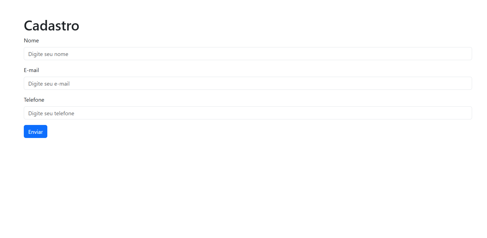

# 📝 Formulário de Cadastro com Bootstrap

Este projeto consiste em um **formulário de cadastro** responsivo, desenvolvido com **HTML** e **Bootstrap**. Ele inclui campos básicos como **Nome**, **E-mail** e **Telefone**, além de um **botão de envio** estilizado.

---

## 🚀 Tecnologias Utilizadas

- **HTML5** - Estrutura do projeto
- **Bootstrap 5** - Estilização e responsividade

---

## 📸 Captura de Tela



---

## 📌 Funcionalidades

✅ Formulário estilizado com **Bootstrap 5**  
✅ Campos de entrada para **Nome, E-mail e Telefone**  
✅ Design responsivo e pronto para **dispositivos móveis**  

---

## 🔧 Como Utilizar

1. **Clone o repositório:**
   ```bash
   git clone https://github.com/ellencigoli/formulario-bootstrap.git
   ```
2. **Acesse a pasta do projeto:**
   ```bash
   cd formulario-bootstrap
   ```
3. Abra o arquivo `index.html` no navegador.

---

## 📝 Melhorias Futuras

- 🔄 Implementação de validação de formulários
- 💾 Integração com um banco de dados para armazenar cadastros
- 🎨 Customização adicional com CSS

---

## 💡 Contribuição

Fique à vontade para sugerir melhorias ou abrir pull requests! 😊

---

## 👩‍💻 Desenvolvedor

- [Ellen Cigoli](https://github.com/ellencigoli/)

Caso tenha dúvidas ou sugestões, entre em contato! 💬
